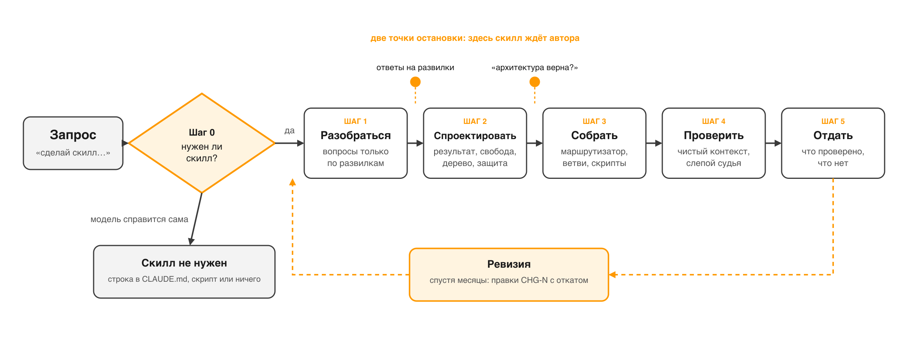

# Skill Architect

Скилл для [Claude Code](https://code.claude.com/docs), который ставит вам
рабочий процесс с AI-ассистентом. Сначала обсуждает, как пойдёт работа: что вы
даёте на входе, что ассистент делает сам, где останавливается и спрашивает вас,
что считается законченным результатом. И только потом собирает под это скилл
или связку скиллов, проверяет их в чистой сессии и честно говорит, что
проверено, а что нет. А если скилл у вас уже есть и оброс правилами, как днище
корабля ракушками, — проводит ревизию.

Версия 2.0 собрана заново после [статьи Anthropic](https://claude.com/blog/the-new-rules-of-context-engineering-for-claude-5-generation-models)
о том, как изменился контекст-инжиниринг для моделей поколения Claude 5. Там
говорится простая вещь: мы годами писали инструкции для моделей, которые уже
не существуют. Убрали больше 80% системного промпта Claude Code, и на
бенчмарках ничего не просело. Инструкции, которые когда-то спасали от худшего,
теперь просто мешают модели думать.

Первая версия этого скилла была ровно такой инструкцией. Вот что изменилось.

## Одна задача, две версии

Я отдал двум версиям архитектора один и тот же запрос в чистых сессиях:
«Сделай скилл для еженедельного отчёта клиентам: берёт цифры из Google Sheets,
считает итоги, пишет письмо и отправляет клиенту через Gmail. Хочу, чтобы это
было в одну команду».

**Версия 1.0** сначала задала пять вопросов, ответы на которые уже были в
запросе. Потом честно сделала «в одну команду». Настолько честно, что
предусмотрела режим, где человек больше не нужен:

```
/weekly-client-report <client-id | all> [--week-end YYYY-MM-DD] [--auto] [--dry-run]

- `--auto` — не ждать подтверждения перед отправкой (по умолчанию ждём: письмо клиенту не отозвать);
...
- НЕ отправляй без предпросмотра, пока пользователь сам не включил `--auto`.
```

Правило вроде есть. Но оно условное: один флаг, и письмо с неверными цифрами
уходит клиенту без чьих-либо глаз. Никто не просил этот флаг. Он появился,
потому что старый архитектор учил «атомарно детализировать» и «предусматривать
все случаи».

**Версия 2.0** сначала посмотрела по сторонам: какие скиллы уже стоят рядом,
что умеет подключённый Google Workspace MCP, есть ли у токена вообще право
отправлять почту. Спросила одно: «сам жмёшь „отправить“ или скилл ждёт твоё
„да“?» И спроектировала так, что обходного режима нет по построению:

```yaml
disable-model-invocation: true
allowed-tools: Read, Write, Bash(python3:*), mcp__google-workspace__read_sheet_values, mcp__google-workspace__search_drive_files
```

```
Никогда не отправляй письмо без недвусмысленного согласия пользователя:
адресат внешний, отозвать письмо нельзя, цифры в нём становятся обещанием.
Согласие — «да», «отправляй», «шли», «го». Не согласие — молчание, «норм»,
«ок» на другой вопрос, правка без команды.
```

Инструмента отправки нет в разрешённых. Скилл не запускается по догадке
модели, только по команде. Цифры считает скрипт, а не модель. Письмо пишется
по рубрике из девяти критериев, а не по сочинённому шаблону, и в отчёте прямо
сказано: «образцов твоих писем в проекте нет, первое утверждённое станет
эталоном».

Судья, который не знал, где какая версия, поставил первой 12 из 18, второй
17 из 18. Остальные четыре задачи ниже, в разделе «Как проверялось».

Разница не в том, что вторая версия умнее. Модель та же. Она просто держит
другую дисциплину: цель и границы вместо метода, жёсткость только там, где
необратимо, образцы автора вместо описания словами, и проверка вместо
«готово, упаковано».



## Что он делает

Берёт запрос, материалы и ваш проект, и проходит пять шагов. На выходе
директория скилла: `SKILL.md` как маршрутизатор, `references/` с условием
чтения у каждого файла, `scripts/` для всего хрупкого и точного, `evals/` с
контрольными задачами. И отчёт: что сделано, как вызывать, что проверено, чем,
что не проверено и почему.

| Режим | Когда | Что происходит |
|---|---|---|
| **Создать** | «сделай скилл», описание задачи, материалы | Пять шагов. Останавливается дважды: после разбора, если есть развилки, и после архитектуры, перед сборкой |
| **Проверить** | «проверь скилл», «не триггерится», «странно себя ведёт» | Триггеры «должен / не должен», типовая задача, редкий маршрут, защитная зона, прогон без скилла. От `claude plugin eval` до сверки чтением, смотря что доступно |
| **Ревизия** | «обнови под Claude 5», «раздулся», «почисти» | Сигналы по шести сдвигам из статьи, правки `CHG-N` с текстом «было → стало» и способом отката, контрольная корзина. По умолчанию только отчёт: ни один файл не тронут, пока вы не сказали «правь» |

## Зачем это, если можно просто попросить модель «сделай скилл»

Можно. И получится файл с алгоритмом из десяти шагов, десятком «ВСЕГДА» и
«НИКОГДА» капсом, тремя примерами вызова инструментов и description, куда
уехал весь процесс. Работать будет. Пока не выяснится, что скилл переспрашивает
известное, срабатывает на чужие запросы, отправляет письмо без подтверждения
или съедает две тысячи токенов в каждом ходу на то, что модель и так умеет.

Проверено: первая версия этого же скилла делала именно так, и я этого не
замечал полгода.

| Что обычно получается | Что делает Skill Architect |
|---|---|
| Скилл нужен не всегда, но собирается всегда | **Шаг 0**: справится ли модель без скилла? Если да, скилл не нужен. Предложит строку в `CLAUDE.md`, скрипт или ничего |
| Пять вопросов на любой запрос, включая те, где всё уже сказано | **Вопросы только по развилкам**, где разные ответы дают разные скиллы. Чёткий запрос идёт в работу с допущениями вслух, размытый не проектируется вслепую |
| «Атомарные шаги» для задач, где важен результат, а не путь | **Цель и границы вместо метода.** Степень свободы выбирается отдельно: скрипт для хрупкого, суждение для вкуса |
| «ВСЕГДА» и «НИКОГДА» на каждом шагу | Императив только в **трёх зонах**: необратимые внешние действия, закон и приватность, известная боль проекта. И всегда с причиной |
| Скилл отправляет, публикует, платит без подтверждения | **Защитные зоны обязательны**: показать, что уйдёт, и ждать «да». `disable-model-invocation` для опасного |
| «Пиши живо, тон дружелюбный» вместо голоса автора | **Богатые референсы**: маршрут к утверждённым образцам автора, рубрика, схема, тест. Образцы вкуса не сочиняются |
| Три примера вызова инструмента | **Интерфейс вместо примеров**: скрипт с говорящими аргументами, перечисление статусов, схема входа и выхода |
| Референс лежит, но когда его читать, неясно | **Условие чтения** у каждого файла, выводимое до того, как файл открыт |
| «Готово, упаковано» | **Проверка обязательна** и в чистом контексте. Отчёт делит: прогнано, проверено чтением, не проверялось |

## Как устроено

| Шаг | Что происходит | Где подробно |
|---|---|---|
| **0. Нужен ли скилл** | Что модель сделает не так без него? Не названо — не нужен | `references/discovery.md` |
| **1. Разобраться** | Вытащить известное из запроса и проекта; спросить по развилкам; три вида запросов | `references/discovery.md` |
| **2. Договориться о процессе** | Карта работы: с чего начинается, что вы даёте, что делает ассистент, где останавливается, что на выходе и куда ложится, что при сбое. Здесь же «готово, когда», полка разрешённого и развилка «один скилл или связка» | `references/process-design.md` |
| **3. Спроектировать устройство** | Мера результата, паттерн и степень свободы, дерево файлов, защитные зоны, поля frontmatter | `references/design.md`, `references/patterns.md` |
| **4. Собрать** | Узкое description без шагов процесса; тело как путеводитель; разделы «готово» и «можно без вопросов»; references, scripts, assets | `references/writing.md` |
| **5. Проверить** | По убыванию силы: `claude plugin eval` → `skill-creator` → субагенты в чистом контексте → сверка чтением; слепое сравнение версий | `references/verification.md`, `references/rubric.md` |
| **6. Отдать** | Проектная или личная директория, плагин; заготовка под калибровку, если работа повторяется; отчёт автору | `SKILL.md` |

Три точки остановки, где скилл ждёт вас: развилки после разбора, карта работы
и устройство перед сборкой.

## Установка

В проект, для команды:

```bash
git clone https://github.com/TimurUgulava/skill-architect .claude/skills/skill-architect
```

Себе, для всех проектов:

```bash
git clone https://github.com/TimurUgulava/skill-architect ~/.claude/skills/skill-architect
```

Дальше просто говорите: «создай скилл для…», «спроектируй скилл», «проверь
скилл», «обнови скилл под Claude 5». Или `/skill-architect`.

## Что внутри

```
skill-architect/
├── SKILL.md                    роль, три режима, шесть сдвигов, пять шагов, маршруты
├── references/
│   ├── discovery.md            шаг 1: развилки, шаг 0, три вида запросов
│   ├── process-design.md       шаг 2: карта работы, «готово, когда», разрешения, один скилл или связка, калибровка
│   ├── design.md               шаг 3: мера результата, свобода, дерево, интерфейсы, референсы, защитные зоны, frontmatter
│   ├── patterns.md             пять паттернов и антипаттерны
│   ├── writing.md              шаг 4: поля frontmatter, description, тело, references, scripts
│   ├── verification.md         шаг 5: уровни проверки, слепое сравнение, отчёт
│   ├── revision.md             режим «Ревизия» для одного скилла
│   └── rubric.md               одиннадцать осей оценки готового скилла
├── scripts/
│   └── check_skill.py          механическая проверка перед выдачей: маршруты, дубли нормы, обязательные разделы
├── evals/
│   ├── README.md               как гонять контрольные задачи
│   ├── evals.json              семь задач с ожиданиями
│   └── fixture-client-report.SKILL.md   плохой скилл для задачи ревизии
├── assets/pipeline.png
├── CHANGELOG.md
├── LICENSE
└── README.md
```

## Как проверялось

Каждая версия сравнивается с предыдущей вслепую, а не объявляется лучше.
Задачи из `evals/evals.json` прогоняются обеими версиями в чистых контекстах
(отдельный агент на задачу, пользователь недоступен, допущения фиксируются),
выходы раскладываются по случайным меткам A и B, и независимые судьи
оценивают их по `references/rubric.md` с цитатами, не зная, где какая версия.

**Версия 2.1 против 2.0**, 15 сентября 2026, шкала 22:

| Задача | 2.0 | 2.1 | Что решило |
|---|---|---|---|
| Ассистент для блога: производство, свежий взгляд, память правок | 17 | 21 | Обе версии заметили, что похожий конвейер у автора уже есть, и отказались строить дубль. Но 2.1 довела работу до проверяемого результата: три части связки, рубрика для независимого рецензента, место под накопление правок |
| Помощник по заметкам со встреч, который «всё время останавливается на полпути» | 18 | 21 | 2.1 дала проверяемый список «готово, когда» с командой доводить до него, полку разрешённого и сняла лишние остановки через `allowed-tools`. 2.0 запретила лишние вопросы, но проверяемого финиша не дала |
| Регресс: отчёт клиенту с отправкой почтой | — | сохранено | Одна остановка перед отправкой, скилл не запускается по догадке модели, инструмент отправки не в разрешённых |

**Версия 2.0 против 1.0**, 14 сентября 2026, шкала 18: пять задач, счёт 12, 12,
12, 14 и 4 из 8 у первой версии против 17, 17, 17, 17 и 8 из 8 у второй.
Показательная находка: на задаче про отчёты клиентам версия 1.0 сама
спроектировала флаг, отключающий подтверждение перед отправкой письма.

Что судьи нашли у 2.1: она всё ещё повторяла норму в двух файлах, хотя
правило «у нормы один адрес» в ней написано. Правила оказалось мало, поэтому
проверка стала кодом — `scripts/check_skill.py`. Запущенный на самом
архитекторе, он тут же нашёл три таких дубля; они устранены.

Чего это не доказывает: что скиллы, собранные этой версией, хороши в бою.
Задачи синтетические, исполнители и судьи — модели, собранные скиллы на
настоящих данных не запускались. Это проверка того, следует ли архитектор
своим правилам.

## Границы

- Архитектор проектирует скиллы, а не выполняет их задачи. И ничего не
  отправляет, не публикует и не платит от их имени: такой скилл он проверяет
  только чтением, потому что отправленное не отозвать.
- Режим ревизии рассчитан на один скилл. Пакет скиллов или весь проект, где
  триггеры пересекаются, а справочники общие, — отдельная, более тяжёлая работа.
- Поля frontmatter и способы проверки взяты из документации Claude Code на
  сентябрь 2026. Выйдет новая версия — стоит сверить.

---

## Автор

[Тимур Угулава](https://t.me/+ZPqkVNfhlA1mNWIy) — про AI-ассистентов, скиллы
и то, как это всё приделать к живой работе.

Контрольные задачи и фикстуры — синтетические, но выросли из настоящих скиллов
автора: производство постов, аудит ботов, разбор встреч.

## Лицензия

MIT — делайте что хотите, ссылка приветствуется.
